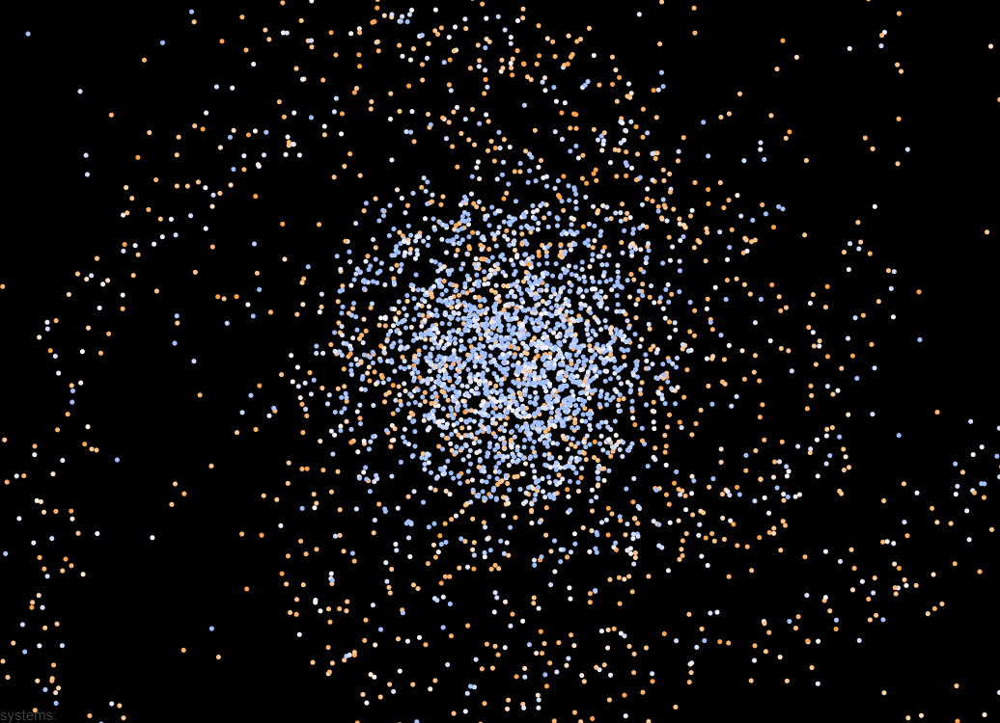
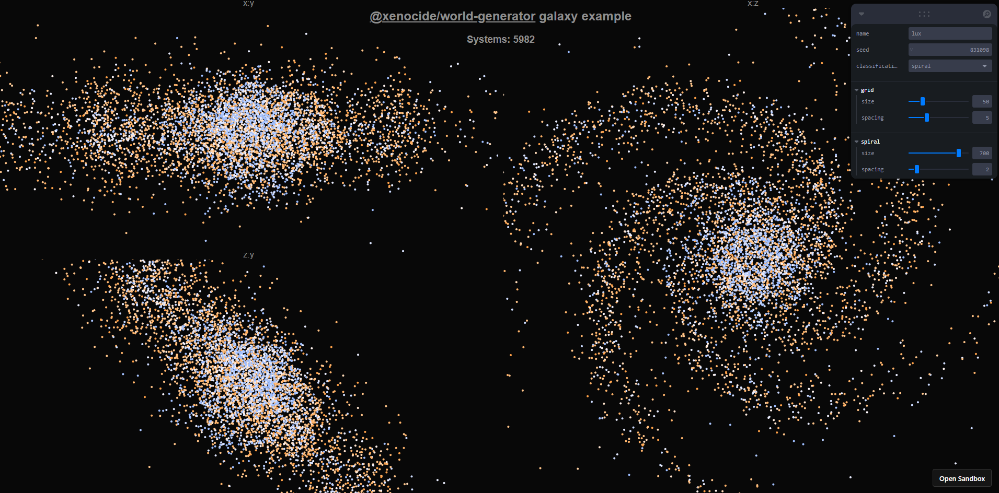
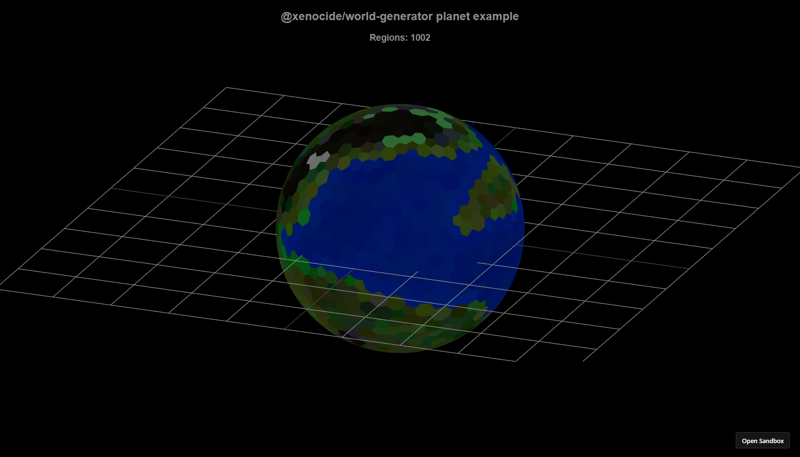
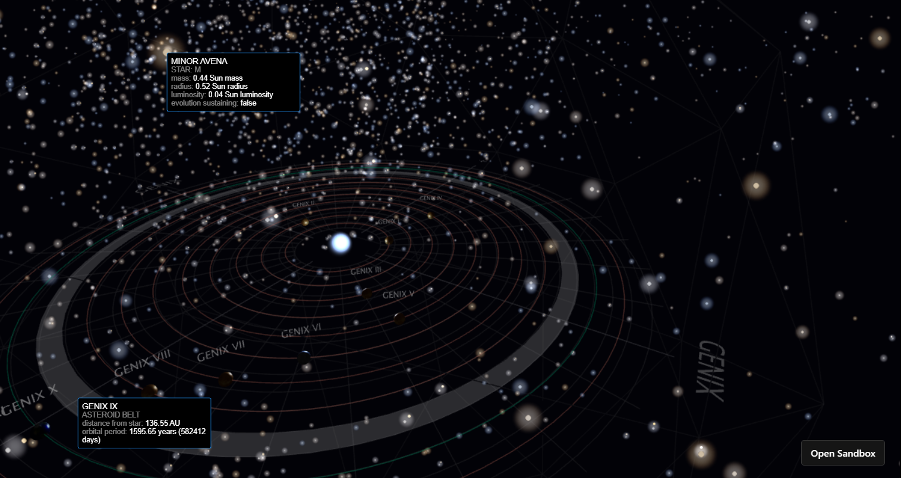

# @xenocide/world-generator

_"Dear World, You are the best for Us!"_ - Artifexian  
TypeScript world generator for 4X like games in 3D space

> In heavy development mess xD
>
> For [CodeSandbox example](https://codesandbox.io/s/1c8gs), use git source with tag `prealpha_0.0.2-rc.1`, package.json example:
>
> ```json
> "dependencies": {
>   "xenocide-world-generator": "https://github.com/duchu-net/xenocide-world-generator@prealpha_0.0.2-rc.1",
> }
> ```
>
> ~~For now generator is developed as part of a private project (galaxy simulator with [nx](https://nx.dev/)),  
> so currently without plans to release as a separate bundle (but can be used as git submodule).~~

# @xenocide/world-generator available on NPM and with TS from 0.0.4!



## Install

```bash
npm i @xenocide/world-generator@0.0.4
```

### Usage

```ts
const { GalaxyGenerator, PlanetGenerator } = require('@xenocide/world-generator');
// or
import { GalaxyGenerator, PlanetGenerator } from '@xenocide/world-generator';
```

Supports ESM and CommonJS modules.

### Examples

New examples coming soon...

<table>
  <tbody>
    <tr>
      <td style="width:33%">Galaxy generator with React and SVG (<a href="https://codesandbox.io/p/sandbox/93rmlv?file=/src/generator.ts">live demo</a>).</td>
      <td>
        <a href="https://codesandbox.io/s/93rmlv">
          
        </a>
      </td>
    </tr>
    <tr>
      <td>Planet generator with React and <a href="https://github.com/pmndrs/react-three-fiber">@react-three/fiber</a> (<a href="https://codesandbox.io/p/sandbox/5q9gvz?file=/src/generator.ts">live demo</a>).</td>
      <td>
        <a href="https://codesandbox.io/s/5q9gvz">
          
        </a>
      </td>
    </tr>
    <tr>
      <td>[*alpha JS version] Full featured generator demo with React, Redux and <a href="https://github.com/pmndrs/react-three-fiber">react-three-fiber</a> (<a href="https://codesandbox.io/p/sandbox/1c8gs?file=/src/modules/generator/generatorStore.js">live demo</a>, <a href="https://www.youtube.com/channel/UCzGMc0qjJMu7PnH4ZdHni2w">video</a>).</td>
      <td>
        <a href="https://codesandbox.io/s/1c8gs">
          
        </a>
      </td>
    </tr>
    <tr>
      <td>[*alpha JS version] Name generation with Markov Chains.</td>
      <td>
        <a href="https://codesandbox.io/s/h4vr6">live demo</a>
      </td>
    </tr>
  </tbody>
</table>

### Code

```js
import { GalaxyGenerator, PlanetGenerator } from '@xenocide/world-generator';

// Spiral shape
const world = new GalaxyGenerator(
  { id: 'demo', classification: 'spiral' },
  { seed: 123, spiral: { size: 500 } }
);
// Grid shape
const world = new GalaxyGenerator(
  { id: 'demo', classification: 'grid' },
  { seed: 123, grid: { size: 15, spacing: 5 } }
);

const systems = [];
for (const system of world.generateSystems()) {
  systems.push(system.path);

  for (const star of system.generateStars()) {
    // console.log('*** Star generated:', star.path, star.toModel());
  }

  /** don't generate too much for tests */
  if (systems.length <= 3) {
    for (const planet of system.generatePlanets()) {
      // console.log('*** Planet/Belt/Etc. generated:', planet.path, planet.toModel());
      if (planet instanceof PlanetGenerator) {
        for (const region of planet.generateSurface()) {
          // console.log('**** Regions generated:', region.path);
        }
      }
    }
  }
}

// Get Plain Object
const model = world.toModel();
```

## Inspired by

- [mainly] [Procedural Planet Generation](https://experilous.com/1/blog/post/procedural-planet-generation) by _Andy Gainey_
- [Star-Citizen-WebGL-Map](https://github.com/Leeft/Star-Citizen-WebGL-Map) by _Lianna Eeftinck_
- [Artifexian (YouTube)](https://www.youtube.com/user/Artifexian) by _Edgar Grunewald_
- [Procedural Generation For Dummies](http://martindevans.me/game-development/2016/01/14/Procedural-Generation-For-Dummies-Galaxies/) by _Martin Evans_
- [X game series](https://www.egosoft.com/games/x4/info_en.php) by Egosoft

### Other links

- [4X games (Wikipedia)](https://en.wikipedia.org/wiki/4X)
- [Stellar classification (Wikipedia)](https://en.wikipedia.org/wiki/Stellar_classification)
- [Holdridge life zones (Wikipedia)](https://en.wikipedia.org/wiki/Holdridge_life_zones)
- [Planet IX](https://planetix.com/)
- [Prosperous Universe](https://prosperousuniverse.com/)
- [Astro Empires](https://www.astroempires.com/)

## todo

- [x] own tsconfig build, not from nx
